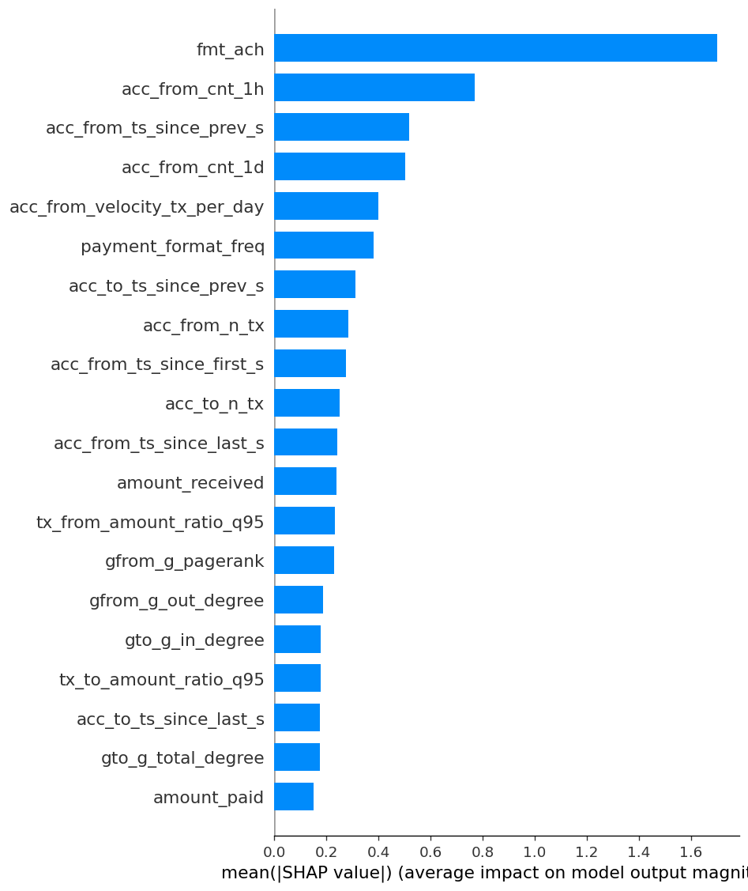
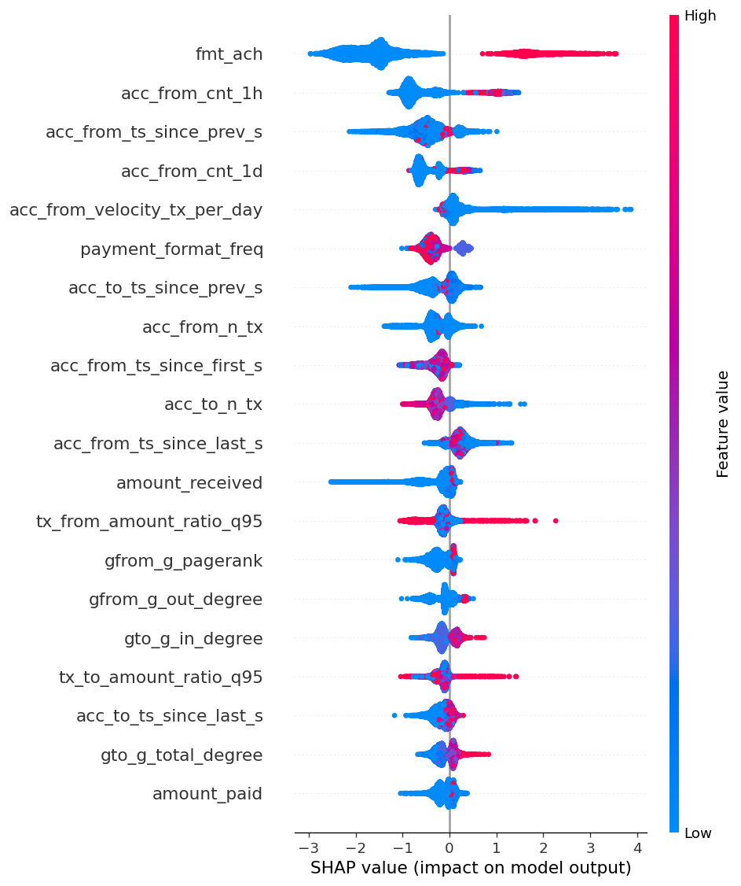
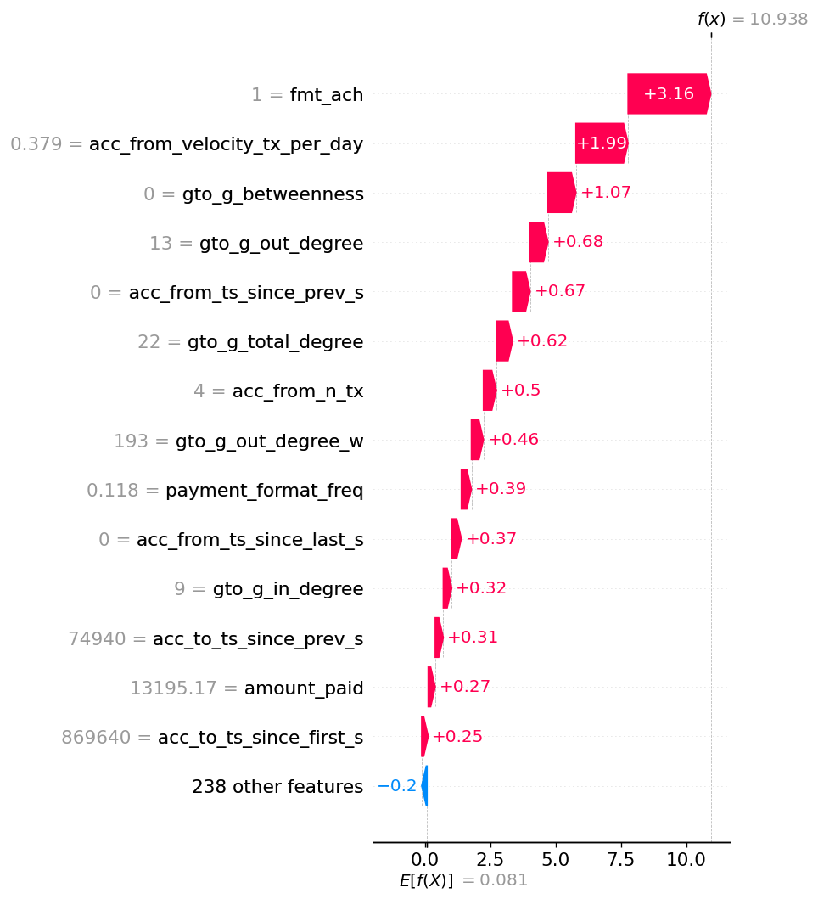
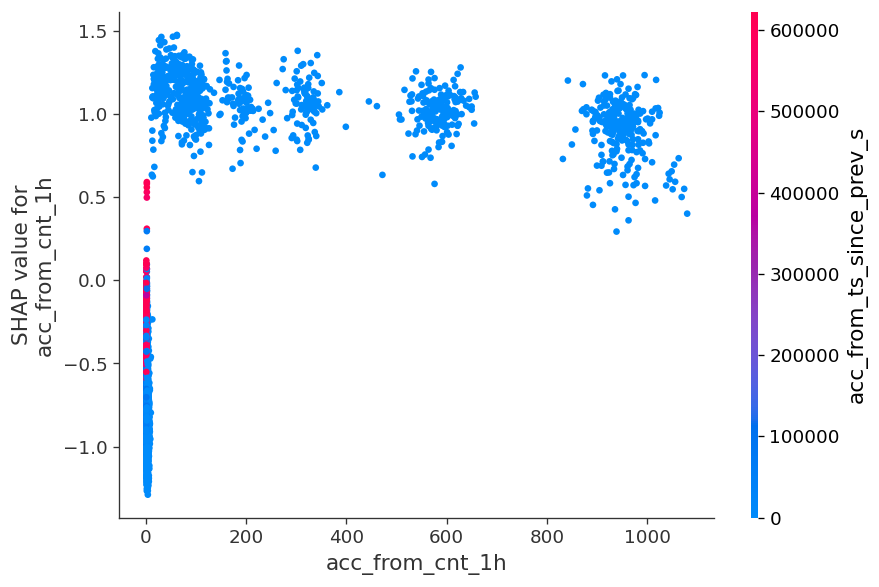

# 🏦 AML Network Intelligence

> Anti-Money Laundering detection using **graph intelligence** and **machine learning**.

[](https://github.com/boutouileabdelkrim-pixel/aml-network-intelligence/actions)
[](https://www.python.org/downloads/release/python-3110/)
[](LICENSE)
[](https://www.docker.com/)
[](https://mlflow.org/)

---

## 🎯 Problem Statement

Suspicious financial activity is not always visible in a single transaction — the real signal often lies in the **network of accounts**.

    Account A
       |
       v
    Account B ---> Account D
       |              |
       v              v
    Account C ---------+

This project detects **abnormal structures and behaviors** in financial networks using a hybrid approach: **tabular ML** + **graph-based feature engineering**.

---

## 🏗️ Architecture

    Raw transactions
          |
          v
    Data cleaning & EDA
          |
          v
    Feature Engineering ---> Tabular features ---> XGBoost / LightGBM
          |
          +---> Graph features ---> Node2Vec / Communities ---> Anomaly detection
          |
          v
    Explainability (SHAP)
          |
          v
    MLflow tracking ---> Docker ---> FastAPI (batch + realtime) ---> Monitoring

---

## 🚀 Quickstart

```bash
git clone git@github.com:boutouileabdelkrim-pixel/aml-network-intelligence.git
cd aml-network-intelligence
make setup
make data
make train
make api
```

---

## 📁 Project Structure

    aml-network-intelligence/
    |-- data/               # Raw / interim / processed / features
    |-- notebooks/          # EDA, graph analysis, SHAP
    |-- src/                # Python source code
    |   |-- data/           # Cleaning, validation
    |   |-- features/       # Tabular + graph features
    |   |-- models/         # Training, tuning
    |   |-- api/            # FastAPI serving
    |   |-- monitoring/     # Drift detection
    |   +-- tracking/       # MLflow
    |-- tests/              # Unit tests
    |-- docker/             # Dockerfile + compose
    |-- docs/               # Documentation
    +-- reports/            # Generated artifacts

---


## 🔍 Exploratory Data Analysis

The raw dataset contains **5,078,345 transactions** over **11 days**
(2022-09-01 → 2022-09-11) with an extreme class imbalance:
only **~0.1 %** are labeled as laundering.

| Metric | Value |
|--------|-------|
| Total transactions | 5,078,345 |
| Laundering transactions | ~6,900 |
| Laundering rate | ~0.14 % |
| Unique source accounts | ~500 k |
| Unique banks | ~30 k |
| Payment formats | 5 (ACH, Wire, Cheque, Credit Card, Reinvestment) |
| Currencies | 5+ (US Dollar, Euro, Yuan, ...) |

### Visual insights

| Target distribution | Amount distribution |
|---|---|
|  |  |

| Categoricals | Temporal |
|---|---|
|  |  |

See notebooks for full analysis:
- [`notebooks/01_eda_raw.ipynb`](notebooks/01_eda_raw.ipynb) — raw EDA
- [`notebooks/02_eda_clean.ipynb`](notebooks/02_eda_clean.ipynb) — post-cleaning


## 📡 Monitoring — Drift Detection

The model is monitored with **Evidently** for data drift. Three scenarios
are tested against the training distribution:

| Scenario | Transformation | Result |
|----------|----------------|--------|
| 1. Baseline | Same distribution | No drift |
| 2. Amount shift | Amounts × 1.5 | Drift on amount features |
| **3. Velocity spike** | **Velocity × 3** | **Drift on temporal features** |

### Velocity spike report


_(open the HTML in a browser for the interactive report)_

The report shows which features drifted, with per-feature
Kolmogorov-Smirnov tests and PSI values.

See [`docs/monitoring.md`](docs/monitoring.md) for the production setup guide.


## 📊 Results

_To be filled after training (Phase 6)._

| Model | PR-AUC | ROC-AUC | F1 |
|-------|--------|---------|-----|
| XGBoost | TBD | TBD | TBD |
| LightGBM | TBD | TBD | TBD |


---
## 🔬 Explainability (SHAP)

SHAP (SHapley Additive exPlanations) is **mandatory for AML** — regulators
require understanding *why* each alert fired.

### Top 20 features driving predictions



| # | Feature | Type | Mean |SHAP| |
|---|---------|------|-----------|
| 1 | `fmt_ach` | categorical | **1.699** |
| 2 | `acc_from_cnt_1h` | temporal | 0.769 |
| 3 | `acc_from_ts_since_prev_s` | temporal | 0.520 |
| 4 | `acc_from_cnt_1d` | temporal | 0.503 |
| 5 | `acc_from_velocity_tx_per_day` | temporal | 0.400 |
| 6 | `payment_format_freq` | categorical | 0.381 |
| 7 | `acc_to_ts_since_prev_s` | temporal | 0.313 |
| 8 | `acc_from_n_tx` | tabular | 0.284 |
| 9 | `acc_from_ts_since_first_s` | temporal | 0.275 |
| 10 | `acc_to_n_tx` | tabular | 0.251 |
| **14** | **`gfrom_g_pagerank`** | **graph** | **0.230** |
| **15** | **`gfrom_g_out_degree`** | **graph** | **0.189** |
| **16** | **`gto_g_in_degree`** | **graph** | **0.179** |
| **19** | **`gto_g_total_degree`** | **graph** | **0.175** |

### Key insights

- **8/20 top features are temporal (velocity)** → fraud manifests as **bursts** of
  transactions in short windows (1h, 1d).
- **4/20 top features are graph-based** → the network signal (`PageRank`,
  `out_degree`, `in_degree`) is real and complementary to tabular data.
- **`fmt_ach` dominates (2.2× #2)** → ACH is the main channel in IBM's AML patterns.

### Beeswarm — distribution of feature impacts



### Local explanation — top-scored transaction



The model flags this transaction because: high 1-hour transaction count,
short time since previous transaction, and high PageRank in the account graph.

### Dependence plot — velocity signal


## 🛠️ Tech Stack

- **Data**: pandas, numpy, scipy, pyarrow
- **ML**: scikit-learn, XGBoost, LightGBM, Optuna, SHAP
- **Graph**: NetworkX, igraph, PyTorch Geometric
- **API**: FastAPI, Uvicorn
- **Ops**: MLflow, Docker, Evidently

---

## 📜 License

MIT — see [LICENSE](LICENSE).

---

## 👤 Author

**boutouileabdelkrim-pixel**
- GitHub: [@boutouileabdelkrim-pixel](https://github.com/boutouileabdelkrim-pixel)
